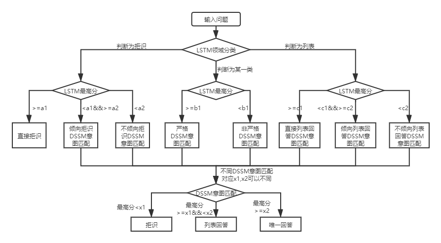
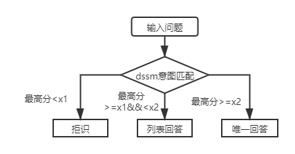
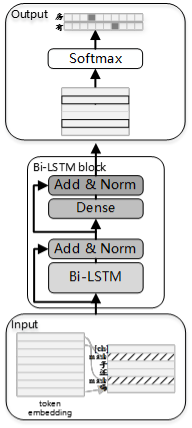
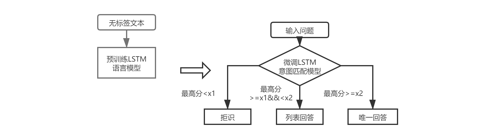

# 项目介绍
qa_match是一款基于深度学习的问答匹配工具，支持一层和两层结构知识库问答。qa_match通过意图匹配模型支持一层结构知识库问答，通过融合领域分类模型和意图匹配模型的结果支持两层结构知识库问答。qa_match同时支持无监督预训练功能，通过轻量级预训练语言模型（SPTM，Simple Pre-trained Model）可以提升基于知识库问答等下游任务的效果。

## 知识库问答
在实际场景中，知识库一般是通过人工总结、标注、机器挖掘等方式进行构建，知识库中包含大量的标准问题，每个标准问题有一个标准答案和一些扩展问法，我们称这些扩展问法为扩展问题。对于一层结构知识库，仅包含标准问题和扩展问题，我们把标准问题称为意图。对于两层结构知识库，每个标准问题及其扩展问题都有一个类别，我们称为领域，一个领域包含多个意图。

qa_match支持知识库结构如下：


对于输入的问题，qa_match能够结合知识库给出三种回答：
1. 唯一回答（识别为用户具体的意图）
2. 列表回答（识别为用户可能的多个意图）
3. 拒识（没有识别出具体的用户意图）

在两种知识库结构下，qa_match的使用方式存在差异，以下分别说明：

### 基于两层结构知识库的自动问答

  

对于两层结构知识库问答，qa_match会对用户问题先进行领域分类和意图识别，然后对两者的结果进行融合，获取用户的真实意图进行相应回答（唯一回答、列表回答、拒绝回答）。
举个例子：如上述知识库问答中[知识库结构图](#知识库问答)所示，我们有一个两层结构知识库，它包括”信息“和”账号“两个领域”。其中“信息”领域下包含两个意图：“如何发布信息”、“如何删除信息”，“账号”领域下包含意图：“如何注销账号”。当用户输入问题为：“我怎么发布帖子？”时，qa_match会进行如下问答逻辑：

1. 分别用LSTM领域分类模型和DSSM意图匹配模型对输入问题进行打分，如：领域分类模型最高打分为0.99且识别为“信息”领域，意图匹配模型最高打分为0.98且识别为“如何发布信息”意图。由于领域分类模型最高打分对应的label为信息类，所以进入判断为某一类分支。
2. 进入判断为某一分类分支后，用领域分类模型的最高打分0.99与两层结构知识库问答图中阈值b1（如b1=0.9）进行对比，由于0.99>=b1,判断为走“严格DSSM意图匹配”子分支。
3. 进入“严格DSSM意图匹配”分支后，用意图匹配模型的最高打分0.98与阈值x1(例如x1=0.8),x2(如x2=0.95)做比较，发现0.98>x2,由此用如何发布信息对应的答案进行唯一回答（其他分支回答类似）。

### 基于一层结构知识库的自动问答

实际场景中，我们也会遇到一层结构知识库问答问题，用DSSM意图匹配模型与SPTM轻量级预训练语言模型均可以解决此类问题，两者对比：

| 模型                     | 使用方法                                       | 优点                                                         | 缺点                                                         |
| ------------------------ | ---------------------------------------------- | ------------------------------------------------------------ | ------------------------------------------------------------ |
| DSSM意图匹配模型         | DSSM匹配模型直接匹配                           | ①使用简便，模型占用空间小<br/>②训练/预测速度快               | 无法利用上下文信息                                           |
| SPTM轻量级预训练语言模型 | 预训练LSTM语言模型<br/>      +微调LSTM匹配模型 | ①能够充分利用无监督预训练数据提升效果<br/>②语言模型可用于其他下游任务 | ①预训练需要大量无标签数据<br/>②操作较复杂（需两个步骤得到匹配模型） |

#### 基于DSSM模型的自动问答


对于一层结构知识库问答，只需用DSSM意图匹配模型对输入问题进行打分，根据意图匹配的最高分值与上图中的x1，x2进行比较决定回答类型（唯一回答、列表回答、拒识）。

#### 基于SPTM模型的自动问答

##### 轻量级预训练语言模型（SPTM，Simple Pre-trained Model）介绍

考虑到实际使用中往往存在大量的无标签数据，在知识库数据有限时，可使用无监督预训练语言模型提升匹配模型的效果。参考[BERT](https://github.com/google-research/bert)预训练过程，2019年5月我们开发了SPTM模型，该模型相对于BERT主要改进了两方面：一是去掉了效果不明显的NSP（Next Sentence Prediction），二是为了提高线上推理性能将Transformer替换成了LSTM，模型原理如下：

###### 数据预处理

预训练模型时，生成训练数据需要使用无标签单句作为数据集，并参考了BERT来构建样本：每个单句作为一个样本，句子中15%的字参与预测，参与预测的字中80%进行mask，10%随机替换成词典中一个其他的字，10%不替换。

###### 预训练

预训练阶段的模型结构如下图所示：




为提升模型的表达能力，保留更多的浅层信息，引入了残差Bi-LSTM网络（Residual LSTM）作为模型主体。该网络将每一层Bi-LSTM的输入和该层输出求和归一化后，结果作为下一层的输入。此外将最末层Bi-LSTM输出作为一个全连接层的输入，与全连接层输出求和归一化后，结果作为整个网络的输出。

预训练任务耗时示例如下表所示： 

| **指标名称**     | **指标值**                       |
| ---------------- | -------------------------------- |
| 预训练数据集大小 | 10Million                        |
| 预训练资源       | Nvidia P40   / 12G Memory        |
| 预训练参数       | step =   500000 / batch size=256 |
| 预训练耗时       | 215.69hour                       |

##### SPTM自动问答流程



引入SPTM后，对于一层结构知识库问答，先使用基于语言模型微调的意图匹配模型对输入问题进行打分，再根据与DSSM意图匹配模型相同的策略决定回答类型（唯一回答、列表回答、拒识）。

## 如何使用
### 数据介绍
需要使用到的数据文件（data_demo文件夹下）格式说明如下，这里为了不泄露数据，我们对标准问题和扩展问题原始文本做了编码，在实际应用场景中直接按照以下格式准备数据即可。  
- std_data：类别和标准问题对应关系，包含类别ID、标准问题ID、标准问题文本三列
- pre_train_data：无标签的预训练数据集，每行是一段文本
- vocab：预训练数据字典，每行是一个词（字典应包含<PAD>、<UNK>、<MASK>）
- train_data：训练集，包含标准问题ID、扩展问题ID、扩展问题文本三列
- valid_data：验证集，包含标准问题ID、扩展问题ID、扩展问题文本三列
- test_data：测试集，包含标准问题ID、扩展问题ID、扩展问题文本三列

数据以\t分隔，问题编码以空格分隔，例如`205 19 90 417 41 44` 对应的实际文本是`如何删除信息`；若知识库结构为一级，需要把std_data文件中的类别id全部设置为`__label__0`。

### 怎么运行
详情见[运行说明](docs/RUNDEMO.md)

### tips
1. 由于DSSM模型训练选取负样本时是将原样本对应标签随机打散，所以模型参数需要满足`batch_size >= negitive_size`，否则模型无法有效训练。
2. 模型融合参数选取方法：目前参数的选取是基于统计的，首先在测试集上计算同一参数（如两层结构知识库问答图中a1）不同值所对应的模型label（如拒识）的f1值，然后选取较大的f1值对应的数值做为该参数的取值。如：在选取两层结构知识库问答图中参数a1的最终取值时,首先会在测试集上得到不同a1候选值对应的模型label（如拒识，非拒识），然后根据样本的真实label计算f1值，最后选取合适的f1值（根据项目需求可偏重准确率/召回率）对应的候选值作为a1的最终取值。

## 运行环境
```
tensorflow 版本>r1.8 <r2.0, python3
```

## 版本
v1.0:https://github.com/wuba/qa_match/tree/v1.0

v1.1:https://github.com/wuba/qa_match/tree/v1.1


## 未来规划
未来我们会继续优化扩展qa_match的能力，计划开源如下：
1. 知识库半自动挖掘流程。基于知识库的构建，我们开发了一套结合人工和机器挖掘的算法流程，已经在生产环境使用，并取得了不错的效果。
2. 目前tensorflow已发版到2.1版本，后续我们会根据需求发布tensorflow 2.X版本或pytorch版本的qa_match。

## 如何贡献&问题反馈
我们诚挚地希望开发者向我们提出宝贵的意见和建议。您可以挑选以下方式向我们反馈建议和问题：
1. 在 github上 提交 PR 或者 Issue
2. 邮件发送至 ailab-opensource@58.com
