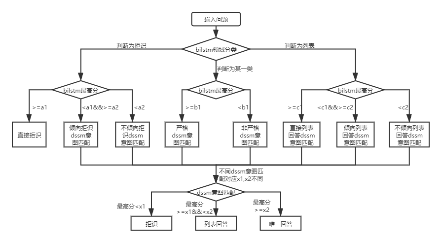

# 项目介绍
qa-match是一款基于深度学习的问答匹配工具，通过问题与问题的匹配实现了一种类似集成学习bagging方法的模型融合方式。qa-match同时支持一层和两层结构知识库问答，对于一层知识库问答，需要知识库中每个问题都有包含一个标签：意图标签。对于二层知识库问答，需要知识库中的每个问题包含两个标签：领域标签和意图标签。

在实际场景中，知识库一般是通过人工总结、标注、机器挖掘的方式进行构建，知识库中包含大量的标准问题，每个标准问题有一个标准答案和一些扩展问法，我们称这些扩展问法为扩展问题。对于一层结构知识库，仅包含标准问题和扩展问题，我们把标准问题称为意图。对于两层结构知识库，每个标准问题及其扩展问题都有一个类别，我们称为领域，标准问题称为意图，一个领域包含多个意图。

对于输入的问题，qa_match会有三种回答：
1. 唯一回答（识别为用户具体的意图）
2. 列表回答（识别为用户可能的多个意图）
3. 拒绝回答（没有识别出具体的用户意图）

为了实现上述目标，qa-match流程如下：
1.  用bilstm对用户语料实现领域级别的文本分类
2.  用dssm对用户语料实现意图级别的语义匹配
3.  通过设置参数对领域分类和意图匹配结果进行融合，支持层级结构知识库问答

其中第3步中两层结构知识库问答融合方式如下：  



## 基于LSTM的预训练模型
在bert模型问世后，我们参考bert预训练的原理开发了基于LSTM的预训练模型，在推理效果跟bert相差不大情况下，参数规模大幅减少、推理性能显著提升、已经在生产环境使用。[预训练模型使用说明](pretrain/README.md)

# 如何使用
## 数据介绍
需要是用到的数据文件（data_demo文件夹下）介绍如下：  
- std_data：类别，标准问题对应关系数据，数据格式`类别id（领域） 标准问题id（意图） 标准问题编码`
- train_data，valid_data，test_data：训练、验证和测试数据，数据格式`标准问题id（意图） 扩展问题id 扩展问题编码`

数据以\t分隔，`问题编码`以空格分隔，若知识库结构为一级，可以把std_data中的类别id设置为__label__0

## 项目运行
1. 把目标数据放入到data_demo目录下。  
2. 运行项目：  

```
bash run.sh
```

## tips
1. 由于dssm模型训练选取负样本时是将原样本对应标签随机打散，所以模型参数需要满足`batch_size >= negitive_size`，否则模型无法有效训练。
2. 模型融合参数选取方法：首先会在测试集上计算同一参数不同阈值所对应标签的f1值，然后选取较大的f1值（根据项目需求可偏重准确率/覆盖率）对应的阈值做为该参数的取值。如：在选取bilstm拒绝回答标签对应参数阈值a1（上图a1）时,首先会在测试集上确定不同的a1取值对应模型的回答标签（模型top1回答为拒绝回答&分值大于a1时则认为拒绝回答，否则认为应该回答），然后根据样本的真实标签计算f1值，最后选取合适的f1值（根据项目需求可偏重准确率/覆盖率）对应的取值作为a1的值。这种基于统计的阈值选取方式比较复杂，将来会进一步的尝试模型拟合选取阈值的方式。                                             


# 运行环境
```
tensorflow 版本>r1.8 <r2.0, python3
```

# 版本
v1.0:https://github.com/wuba/qa_match/tree/v1.0

v1.1:https://github.com/wuba/qa_match/tree/v1.1

v1.2:https://github.com/wuba/qa_match/tree/v1.2

# 未来规划
未来我们会继续优化扩展qa_match的能力，计划开源如下：
1. 知识库半自动挖掘流程。基于知识库的构建，我们开发了一套结合人工和机器挖掘的算法流程，已经在生产环境使用，并取得了不错的效果。
2. 目前tensorflow已发版到2.1版本，后续我们会根据需求发布tensorflow 2.X版本或pytorch版本的qa_match。

# 如何贡献&问题反馈
我们诚挚地希望开发者向我们提出宝贵的意见和建议。您可以挑选以下方式向我们反馈建议和问题：
1. 在 github上 提交 PR 或者 Issue
2. 邮件发送至 ailab-opensource@58.com
