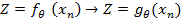
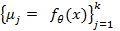
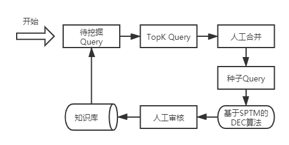
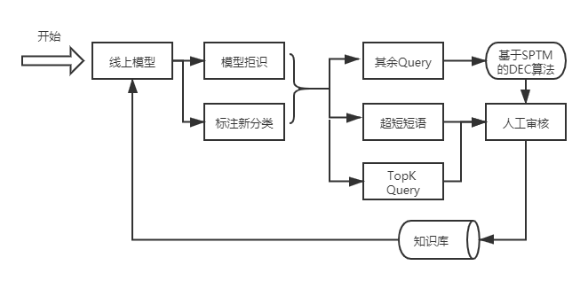
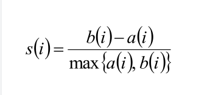

# 知识库半自动挖掘

在智能问答的场景下，知识库一般是通过人工总结、标注、机器挖掘等方式进行构建，知识指在不同场景积累的业务问题，知识库中包含大量的标准问题，每个标准问题有一个标准答案和一些扩展问法，我们称这些扩展问法为扩展问题。
知识库半自动挖掘流程在智能问答场景下有两处具体场景的应用： 一个是在知识库构建的冷启动阶段挖掘初始知识；第二个是在模型上线以后持续迭代挖掘新知识。两个流程依赖的核心算法都是基于[SPTM](https://github.com/wuba/qa_match/tree/v1.1#%E5%9F%BA%E4%BA%8Esptm%E6%A8%A1%E5%9E%8B%E7%9A%84%E8%87%AA%E5%8A%A8%E9%97%AE%E7%AD%94) 预训练模型的DEC挖掘算法，区别在于在冷启动挖掘时，知识库没有标准问题，需要通过自动/人工的方式提供初始标准问题；在迭代挖掘流程中，已经有标准问题，可以使用自定义聚类中心的方法挖掘扩展问法（utterance）。


## 基于SPTM预训练模型的改进DEC算法

[DEC（Deep Embedding Cluster）]( https://arxiv.org/abs/1511.06335)算法是ICML2016发表的关于无监督聚类的文章，传统聚类的方法例如K-means、 GMM、谱聚类已经在工业界有广泛的使用，但是这些算法里少有考虑到学习适合聚类的特征表征，DEC算法正是将特征的表征与聚类中心分配一同学习。DEC详细算法原理参考 [深度文本的表征与聚类在小样本场景中的探索](https://mp.weixin.qq.com/s?biz=MzI1NDc5MzIxMw==&mid=2247487874&idx=1&sn=e9e64a5d47f9b1f113aae4f575fcc5e2&chksm=ea3e9510dd491c061163760ff519f11aa84af3022f9088310741a47c3cc0974f69fb6770ad53&mpshare=1&scene=1&srcid=05155uiaAEcUi4TmoNUFvFvV&sharer_sharetime=1603958352741&sharer_shareid=3328ef87ce9d1d41035c2de06c0401a6&key=a6a963ce8dc9af21faa2ed8f4582d7de70cd136c43520e9bff714e2f8f74d6b8f0a67f8a09599f5a27d280e211e5366b14a74dfab8e70da4ea6c2f0a9a7499b9f18dddda3e795ac94b896749383613f7ba333bba4dc276c52617000bc3941c884f8f1b65d6b1469eab748aba1f860c969304efc2638860908e2eda42336f1465&ascene=1&uin=MTEwMTQ1ODQwMA%3D%3D&devicetype=Windows+10+x64&version=6300002f&lang=zh_CN&exportkey=ARy78MhGlgOu4Q0Y6Bx%2BaXc%3D&pass_ticket=S39hMrq8TCx6UHj%2Bow6NYZsNy%2BUlWA3RPZ9Nfx5mp5BCOHEAlMauBsPOR4jML3wN&wx_header=0) 文章中关于DEC算法描述的部分 。
考虑到静态聚类方法表征能力不足的问题，我们在2019年9月在问答场景实现了DEC算法应用于知识库的挖掘，并结合场景特点对DEC算法做出改进。我们对原始的DEC算法做了以下两点改进：

* 替换表征：原始DEC算法论文中使用DNN 结构的auto-encoder 作为通用特征表征，而在我们实验的时候，在垂直场景我们有表征能力更强的预训练模型，于是我们把原始DEC算法中的表征层替换为垂直场景的SPTM预训练模型，相比通用的auto-encoder 在文本场景，表征能力更强；后续聚类过程在这个表征基础上进行微调。



* 自定义中心：在原始的DEC算法中，唯一的有监督信号是由K-means做聚类中心初始化时给到的，后续的训练过程实际上是对这个分布的高置信部分做强化，可以说，聚类中心初始化的效果决定着整个DEC算法的效果，但是K-means的聚类结果有很强的随机性，所以我们使用自定义聚类中心替代了原始DEC算法中K-means聚类出的聚类中心，使用已有的标准问的所有扩展问法向量的平均作为该标准问的向量，也就是自定义的聚类中心，这样DEC后续学习到的数据分布是按照目前已拟定的标准问题作为聚类中心得到的。




## 第一个场景：冷启动挖掘流程

 

冷启动阶段挖掘初始知识具体指在新场景接入自动问答时，存在一定量的历史无监督数据，但是没有形成知识，通过挖掘总结出标准问和扩展问。

 

冷启动挖掘流程图如下：

 



 

###  **冷启动知识挖掘步骤**

 

1. 种子query 选取： 在冷启动场景，首要需求是覆盖头部问题，所以我们一般的做法是选取基于频次的topk 问题（也可以基于别的标准），经过人工合并归纳后作为第一批种子query。

2. 基于SPTM预训练表征的DEC算法挖掘 : 使用改进的DEC算法，借助SPTM预训练模型的表征，使用步骤1得到的种子query作为自定义聚类中心，使用DEC算法进行聚类。

3. 人工审核入库： 将种子query 作为标准问题，选取聚类概率>阈值的样本点作为扩展问题，进行人工审核入库。

 

## 第二个场景：迭代挖掘流程

 

知识库迭代挖掘场景具体指模型已经上线后，知识库中已经有了一定数量的标准问题和扩展问题，但是由于线上数据是动态变化的，所以存在模型覆盖不到的标准问题和扩展问法，迭代挖掘的目的就是及时的将它们挖掘出来，增加线上样本覆盖度，从而提高模型准召。

 

迭代挖掘流程图如下：

 



 

### 迭代挖掘步骤

 

1. 基于目前自动问答流程（参考[qa match 基于一层知识库结构的自动问答](https://github.com/wuba/qa_match/tree/master#%E5%9F%BA%E4%BA%8E%E4%B8%80%E5%B1%82%E7%BB%93%E6%9E%84%E7%9F%A5%E8%AF%86%E5%BA%93%E7%9A%84%E8%87%AA%E5%8A%A8%E9%97%AE%E7%AD%94)），从线上拒识问题以及每周人工抽样标注的新分类问题（目前标准问题没有覆盖到并且非拒识的问题）中提取新知识。

2. 粗略筛除几类问题：

   a）超短query（长度小于3的线上问题，这个类别是optional的，根据具体场景实现）。此类query 在问答场景通常会被拒识，若不拒识，大部分通过匹配实现。

   b）高频问题。对于高频问题，一定要覆盖，不需要再经过挖掘，直接筛选出来交给人工审核进行入库，剩余问题送入DEC算法模块进行挖掘。

3. 初步筛出比较纯粹的query 之后，使用已有标准问题作为自定义聚类中心，选取聚类结果概率值 > 阈值的样本点作为扩展问题，进行人工审核入库；对于挖掘新类别的标准问题，可以参考冷启动场景的方法进行挖掘。

# 运行说明

 

本示例给出了支持一层结构知识库的基于SPTM表征的DEC挖掘算法运行demo、评测指标及在测试集的效果。

 

## 数据介绍


 需要使用到的数据文件（dec_mining/data 文件夹下）格式说明如下，这里为了不泄露数据，我们对标准问题和扩展问题原始文本做了编码，在实际应用场景中直接按照以下格式准备数据即可。所给出聚类数据集，取自58智能问答生产环境下的真实数据，这里仅为了跑通模型，因此只取了少部分数据，其中待聚类数据1w。

 

* [trainset](./data/trainset)：待聚类数据。两列\t分隔，第一列为 ground truth 标签问题ID ，格式 `__label__n`；如果没有ground truth 标签，也需要设置一个n进行占位，查看聚类结果时忽略掉即可；第二列为标准问题文本，分字格式（空格切分）。
* [topk.std.text.avg](./data/topk.std.text.avg) ： 自定义聚类中心文件。该文件为从topk问题总结出的标准问，每行为一个聚类中心，支持多个问题的平均作为聚类中心的格式 使用斜杠/分隔，如：“你好这辆车还在么/车还在吗/这车还在吗”


## 运行示例

 

使用DEC算法进行聚类需要两步，先train 也就是先微调表征，然后再做inference得到聚类结果。


（1）  根据自定义聚类中心文本得到表征，此步骤可选，如果选择使用K-means做初始化，则不需要此步骤，在步骤（2）指定 `n_clusters` 即可


```bash
cd dec_mining && python3 print_sen_embedding.py --input_file=./topk.std.text.avg --vocab_file=./vocab --model_path=./pretrain_model/lm_pretrain.ckpt-1000000  --batch_size=512  --max_seq_len=50 --output_file=./topk.std.embedding.avg --embedding_way=max
```

参数说明：

  input_file：自定义聚类中心文本。

  vocab_file : 词典文件（需要包含 `<PAD><UNK><MASK>` )

  model_path: SPTM预训练表征模型，预训练模型的embedding的维度要跟第（2）步的embedding_dim参数保持一致

  max_seq_len: 截断的最大长度

  output_file: 输出的自定义聚类中心表征文件


（2） 使用待聚类数据进行微调表征

```bash
cd dec_mining && python3 ./train.py --init_checkpoint=./pretrain_model/lm_pretrain.ckpt-1000000 --train_file=./data/trainset --epochs=30 --lstm_dim=128 --embedding_dim=256 --vocab_file=./vocab --external_cluster_center=./topk.std.embedding.avg --model_save_dir=./saved_model --learning_rate=0.03 --warmup_steps=5000
```

 

  参数说明：

 

  init_checkpoint: SPTM预训练表征模型

  train_file: 待聚类数据

  epochs: epoch 数量

  n_clusters: K-means 方法指定聚类中心数；此参数与external_cluster_center 只传入一个即可，需要与步骤（3）中inference 过程使用的参数一致，指定`n_clusters`表示使用K-means做初始化，指定external_cluster_center表示使用自定义聚类中心做初始化

  lstm_dim: SPTM lstm的门控单元数

  embedding_dim: SPTM 词嵌入维度，需要设置为lstm_dim 参数的2倍

  vocab_file: 词典文件（需要包含 `<PAD><UNK><MASK>`)

  external_cluster_center: 自定义聚类中心文件，此参数与n_clusters 只传入一个即可，需要与步骤（3）中inference 过程使用的参数一致，指定`n_clusters`表示使用K-means做初始化，指定external_cluster_center表示使用自定义聚类中心做初始化

  model_save_dir: DEC模型保存路径

  learning_rate: 学习率


  warmup_steps：学习率 warm up 步数


（3） 根据微调好的表征对待聚类数据进行DEC聚类

 

```bash
cd dec_mining  && python3 inference.py --model_path=./saved_model/finetune.ckpt-0 --train_file=./data/trainset --external_cluster_center=./topk.std.embedding.avg --lstm_dim=128 --embedding_dim=256 --vocab_file=./vocab --pred_score_path=./pred_score
```

 

  参数说明：

 

  model_path: 上一步train 得到的DEC模型

  train_file: 待聚类数据

  lstm_dim: SPTM lstm的门控单元数

  embedding_dim: SPTM 词嵌入维度

  vocab_file: 词典文件（需要包含 `<PAD><UNK><MASK>` )

  pred_score_path： 聚类结果打分文件，格式：`pred_label + \t + question + \t + groundtruth_label + \t + probability` 例如：`__label__4`    请添加车主阿涛微信详谈     `__label__0    ` 00.9888488

 

## 算法评测指标及测试集效果

 

  聚类算法的评估一般分为外部评估和内部评估，外部评估是指数据集有ground truth label 时通过有监督标签进行评估； 内部评估是不借助外部可信标签，单纯从无监督数据集内部评估，内部评估的原则是类内距小，类间距大，这里我们使用轮廓系数（silhouette）来评估。

 

  **轮廓系数 silhouette coefficient**

 



 

* a(i) = avg(i 向量到所有它属于的簇中其他点的距离)

* b(i) = min(i 向量与其他的簇内的所有点的平均)

* 值介于 [-1,1] ，越趋近于1代表内聚度和分离度都相对较优

* 将所有点的轮廓系数求平均，就是该聚类结果总的轮廓系数

 

  **准确率accuracy计算**

  [sklearn linear_assignment](https://www.kite.com/python/docs/sklearn.utils.linear_assignment_.linear_assignment)


归纳top10 问题后，运行后评测效果如下（使用通用深度学习推理服务[dl_inference](https://github.com/wuba/dl_inference)开源项目部署模型来评测推理耗时）：

 

| 数据集 | 模型 | **Silhouette** | **Runtime** |  **Inference Time** | **Accuracy** |
| ------ | ---- | -------------- | ----------- |------------ | ------------ |
| 1w     | DEC  | 0.7962         | 30min       | 52s       |0.8437       |
| 10W    | DEC  | 0.9302         | 3h 5min     | 5min 55s           |--           |
| 100W   | DEC  |    0.849            | 11h30min |15min 28s           | --           |

**tips:**

1. 由于实验场景有标签数据集数量 < 10w，因此10w， 100w数据集上没有accuracy的数值

 

## 运行环境

 

```
tensorflow 版本>r1.8 <r2.0, python3
```
