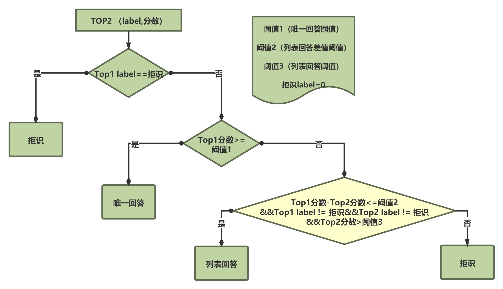

# 介绍
```pretrain```是```qa_match```的子模块，其目的也是将用户的输入问题划分到以下几种回答中：

>1.唯一回答（识别为用户具体的意图）
>
>2.列表回答（识别为用户可能的多个意图）
>
>3.拒绝回答（没有识别出具体的用户意图）

```pretrain```的特点是引入了自定义的预训练语言模型进行预训练和微调，从而可利用无标签文本提升分类器的效果。

为了实现上述目标，流程如下：
1.  用无标签文本训练得到预训练语言模型
2.  用带标签文本微调得到分类模型
3.  通过阈值对分类模型的结果进行划分，得到不同类型的回答

其中第3步中阈值划分的方式如下：  



# 如何使用
## 数据介绍
除了```qa_match```主体用到的数据文件外，还包括以下数据文件（同样在项目根目录的data_demo文件夹下）：  
- pretrain_data：预训练数据，数据格式`扩展问题编码`
- vocab：数据字典，key=行号，value=该行的内容，数据格式`token`

如自行生成字典，注意其中应当包含```<UNK>```这个token。

## 项目运行
1. 把目标数据放入到data_demo目录下。  
2. 运行项目：  

```
cd pretrain
bash run.sh
```

# 运行环境
```
tensorflow 版本>r1.8 <r2.0, python3
```